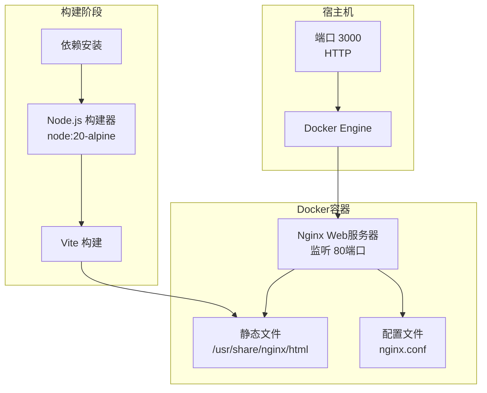
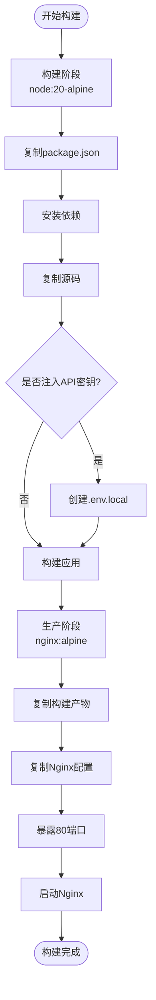
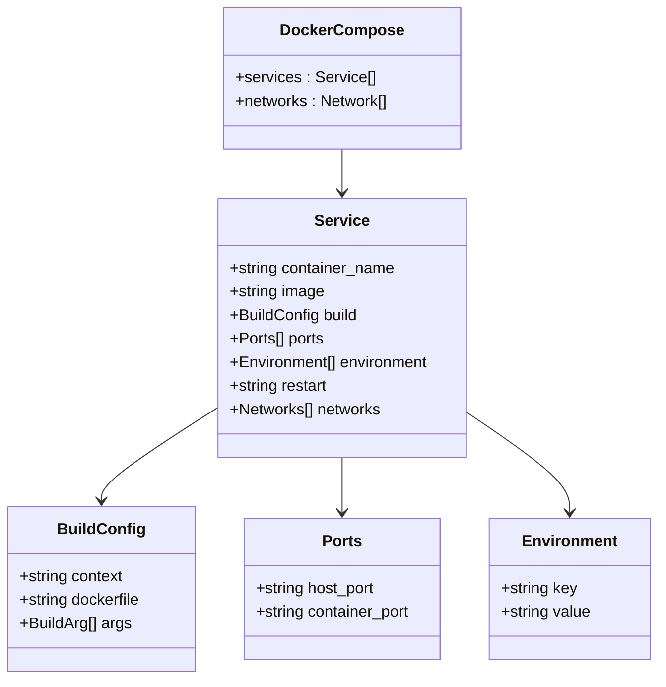
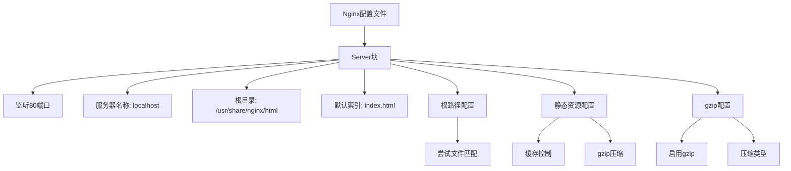

# 部署指南

<cite>
**本文档中引用的文件**
- [DOCKER.md](file://DOCKER.md)
- [Dockerfile](file://Dockerfile)
- [docker-compose.yml](file://docker-compose.yml)
- [nginx.conf](file://nginx.conf)
- [package.json](file://package.json)
- [README.md](file://README.md)
- [vite.config.ts](file://vite.config.ts)
- [constants.ts](file://constants.ts)
</cite>

## 目录
1. [简介](#简介)
2. [系统要求](#系统要求)
3. [Docker化部署架构](#docker化部署架构)
4. [快速启动方式](#快速启动方式)
5. [Dockerfile详解](#dockerfile详解)
6. [docker-compose.yml配置](#docker-composeyml配置)
7. [Nginx配置详解](#nginx配置详解)
8. [环境变量配置](#环境变量配置)
9. [生产环境最佳实践](#生产环境最佳实践)
10. [常用Docker命令](#常用docker命令)
11. [故障排除指南](#故障排除指南)

## 简介

BananaCanvas是一个基于React和TypeScript开发的AI艺术创作工具，支持使用Gemini API进行图像生成。本部署指南详细介绍了如何使用Docker技术将应用容器化，并提供完整的生产环境部署方案。

该应用采用前后端分离架构，前端使用Vite构建，后端通过Nginx托管静态文件，整个应用被封装在一个Docker容器中，便于部署和维护。

## 系统要求

### 基础要求
- **Docker Engine**: 版本 20.10.0 或更高
- **Docker Compose**: 版本 2.0.0 或更高
- **内存**: 至少 512MB 可用内存
- **存储**: 至少 1GB 可用磁盘空间

### 网络要求
- **端口 3000**: 用于访问Web界面（可在配置中修改）
- **网络连接**: 访问Gemini API需要互联网连接

## Docker化部署架构



**图表来源**
- [Dockerfile](file://Dockerfile#L1-L36)
- [docker-compose.yml](file://docker-compose.yml#L1-L18)

### 架构特点

1. **多阶段构建**: 使用Node.js作为构建器，Alpine Linux作为运行时基础镜像
2. **Nginx托管**: 高性能Web服务器托管React应用
3. **环境隔离**: 完全隔离的容器环境
4. **端口映射**: 宿主机3000端口映射到容器80端口

**章节来源**
- [Dockerfile](file://Dockerfile#L1-L36)
- [docker-compose.yml](file://docker-compose.yml#L1-L18)

## 快速启动方式

### 方式一：使用 docker-compose（推荐）

这是最简单和推荐的部署方式，适合大多数用户。

#### 步骤 1：准备工作

确保已安装Docker和Docker Compose：

```bash
# 检查Docker版本
docker --version

# 检查Docker Compose版本
docker compose version
```

#### 步骤 2：启动服务

```bash
# 在项目根目录下运行
cd /path/to/banana-canvas

# 构建并启动服务（后台运行）
docker-compose up -d

# 查看实时日志
docker-compose logs -f

# 停止服务
docker-compose down
```

#### 访问应用

启动完成后，访问：[http://localhost:3000](http://localhost:3000)

### 方式二：使用 Docker 命令

适用于简单的单容器部署场景。

#### 步骤 1：构建镜像

```bash
# 构建Docker镜像
docker build -t banana-canvas .
```

#### 步骤 2：运行容器

```bash
# 运行容器（端口映射：3000:80）
docker run -d -p 3000:80 --name banana-canvas-app banana-canvas
```

#### 步骤 3：管理容器

```bash
# 停止容器
docker stop banana-canvas-app

# 删除容器
docker rm banana-canvas-app
```

**章节来源**
- [DOCKER.md](file://DOCKER.md#L5-L39)

## Dockerfile详解

### 多阶段构建结构



**图表来源**
- [Dockerfile](file://Dockerfile#L1-L36)

### 构建阶段（Node.js）

1. **基础镜像**: 使用官方Node.js Alpine Linux版本
2. **工作目录**: 设置 `/app` 为工作目录
3. **依赖安装**: 先复制package文件，再安装依赖
4. **环境变量注入**: 支持构建时注入GEMINI_API_KEY

### 生产阶段（Nginx）

1. **基础镜像**: 使用轻量级Alpine Linux版Nginx
2. **文件复制**: 从构建阶段复制dist目录到Nginx HTML目录
3. **配置覆盖**: 复制自定义nginx.conf配置文件
4. **端口暴露**: 暴露80端口供外部访问

### 关键特性

- **Alpine Linux**: 轻量级基础镜像，减少镜像大小
- **环境变量注入**: 支持构建时注入API密钥
- **多阶段优化**: 分离构建和运行环境，提高安全性

**章节来源**
- [Dockerfile](file://Dockerfile#L1-L36)

## docker-compose.yml配置

### 服务定义



**图表来源**
- [docker-compose.yml](file://docker-compose.yml#L1-L18)

### 配置详解

| 配置项 | 值 | 说明 |
|--------|-----|------|
| `container_name` | banana-canvas-app | 容器名称 |
| `ports` | 3000:80 | 宿主机:容器端口映射 |
| `environment` | NODE_ENV=production | 环境变量设置 |
| `restart` | unless-stopped | 重启策略 |
| `networks` | banana-network | 网络配置 |

### 网络配置

- **网络类型**: Bridge网络驱动
- **网络名称**: banana-network
- **通信**: 容器间可通过服务名通信

### 重启策略

- **unless-stopped**: 容器异常退出时自动重启
- **持久性**: 系统重启后容器不会自动启动

**章节来源**
- [docker-compose.yml](file://docker-compose.yml#L1-L18)

## Nginx配置详解

### 配置结构



**图表来源**
- [nginx.conf](file://nginx.conf#L1-L24)

### 核心配置

| 配置项 | 值 | 功能 |
|--------|-----|------|
| `listen` | 80 | 监听端口 |
| `server_name` | localhost | 服务器名称 |
| `root` | /usr/share/nginx/html | 静态文件根目录 |
| `index` | index.html | 默认索引文件 |

### SPA路由支持

```nginx
location / {
    try_files $uri $uri/ /index.html;
}
```

- **功能**: 支持单页应用的客户端路由
- **机制**: 当请求的文件不存在时，返回index.html

### 静态资源优化

#### 缓存配置
```nginx
location ~* \.(js|css|png|jpg|jpeg|gif|ico|svg|woff|woff2|ttf|eot)$ {
    expires 1y;
    add_header Cache-Control "public, immutable";
}
```

- **缓存时间**: 1年
- **缓存策略**: public, immutable
- **支持格式**: JavaScript、CSS、图片、字体等

#### Gzip压缩
```nginx
gzip on;
gzip_vary on;
gzip_min_length 1024;
gzip_types text/plain text/css text/xml text/javascript application/x-javascript application/xml+rss application/javascript application/json;
```

- **最小长度**: 1KB
- **压缩类型**: 文本和JavaScript相关类型

**章节来源**
- [nginx.conf](file://nginx.conf#L1-L24)

## 环境变量配置

### API密钥配置

#### 方法一：构建时注入

```bash
# 使用docker-compose
docker-compose build --build-arg GEMINI_API_KEY=your_api_key_here

# 使用docker build
docker build --build-arg GEMINI_API_KEY=your_api_key_here -t banana-canvas .
```

#### 方法二：运行时配置

在运行容器时设置环境变量：

```bash
docker run -d \
  -p 3000:80 \
  -e GEMINI_API_KEY=your_api_key_here \
  --name banana-canvas-app \
  banana-canvas
```

### 环境变量映射

根据项目配置，以下环境变量会被使用：

| 变量名 | 来源 | 用途 |
|--------|------|------|
| `GEMINI_API_KEY` | 用户提供 | Gemini API认证 |
| `NODE_ENV` | docker-compose.yml | Node.js环境设置 |

### Vite配置集成

项目使用Vite进行构建时会处理环境变量：

```typescript
define: {
  'process.env.API_KEY': JSON.stringify(env.GEMINI_API_KEY),
  'process.env.GEMINI_API_KEY': JSON.stringify(env.GEMINI_API_KEY),
  'process.env.AIHUBMIX_API_KEY': JSON.stringify(env.AIHUBMIX_API_KEY)
}
```

**章节来源**
- [DOCKER.md](file://DOCKER.md#L41-L51)
- [vite.config.ts](file://vite.config.ts#L1-L24)

## 生产环境最佳实践

### 环境隔离

#### 网络隔离
```yaml
networks:
  banana-network:
    driver: bridge
    internal: false  # 外部可访问
```

#### 资源限制
```yaml
banana-canvas:
  mem_limit: 512m
  cpu_quota: 50000  # 50%
  restart: unless-stopped
```

### 日志管理

#### 日志配置
```yaml
banana-canvas:
  logging:
    driver: "json-file"
    options:
      max-size: "10m"
      max-file: "3"
```

#### 日志查看
```bash
# 查看容器日志
docker logs -f banana-canvas-app

# 查看最近100行日志
docker logs --tail 100 banana-canvas-app

# 实时跟踪日志
docker logs -f --tail 10 banana-canvas-app
```

### 容器监控

#### 健康检查
```yaml
banana-canvas:
  healthcheck:
    test: ["CMD", "curl", "-f", "http://localhost/health"]
    interval: 30s
    timeout: 10s
    retries: 3
    start_period: 40s
```

#### 性能监控
```bash
# 查看容器资源使用情况
docker stats banana-canvas-app

# 查看容器详细信息
docker inspect banana-canvas-app
```

### 安全配置

#### 用户权限
```dockerfile
# 在Dockerfile中添加
RUN addgroup -g 1001 -S nginx && \
    adduser -u 1001 -S nginx -G nginx
USER nginx
```

#### 文件权限
```bash
# 设置正确的文件权限
chmod 644 nginx.conf
chmod 755 docker-entrypoint.sh
```

### 备份策略

#### 数据备份
```bash
# 备份配置文件
docker cp banana-canvas-app:/etc/nginx/nginx.conf ./backup/

# 备份日志文件
docker exec banana-canvas-app tar czf /tmp/logs.tar.gz /var/log/nginx/
docker cp banana-canvas-app:/tmp/logs.tar.gz ./backup/
```

#### 镜像备份
```bash
# 导出镜像
docker save banana-canvas > banana-canvas-$(date +%Y%m%d).tar

# 导入镜像
docker load < banana-canvas-20240101.tar
```

## 常用Docker命令

### 容器管理

```bash
# 查看运行中的容器
docker ps

# 查看所有容器（包括停止的）
docker ps -a

# 进入正在运行的容器
docker exec -it banana-canvas-app sh

# 查看容器详细信息
docker inspect banana-canvas-app

# 查看容器资源使用情况
docker stats banana-canvas-app
```

### 镜像管理

```bash
# 查看本地镜像
docker images

# 删除指定镜像
docker rmi banana-canvas

# 清理未使用的镜像
docker image prune -f

# 清理所有未使用对象
docker system prune -f
```

### 日志管理

```bash
# 查看容器日志
docker logs banana-canvas-app

# 实时跟踪日志
docker logs -f banana-canvas-app

# 查看最近100行日志
docker logs --tail 100 banana-canvas-app

# 查看包含错误的日志
docker logs banana-canvas-app 2>&1 | grep ERROR
```

### 网络管理

```bash
# 查看网络列表
docker network ls

# 查看网络详情
docker network inspect banana-network

# 连接容器到网络
docker network connect banana-network banana-canvas-app

# 断开容器网络
docker network disconnect banana-network banana-canvas-app
```

### 卷管理

```bash
# 查看卷列表
docker volume ls

# 创建数据卷
docker volume create banana-data

# 查看卷详情
docker volume inspect banana-data

# 删除卷
docker volume rm banana-data
```

### 系统信息

```bash
# 查看Docker系统信息
docker info

# 查看Docker版本
docker version

# 查看Docker守护进程状态
docker system df
```

**章节来源**
- [DOCKER.md](file://DOCKER.md#L61-L79)

## 故障排除指南

### 常见问题及解决方案

#### 1. 端口冲突

**问题**: 端口3000已被占用
```bash
# 错误信息示例
Error starting userland proxy: listen tcp4 0.0.0.0:3000: bind: address already in use
```

**解决方案**:
```bash
# 查找占用端口的进程
sudo lsof -i :3000

# 修改docker-compose.yml中的端口映射
ports:
  - "3001:80"  # 使用其他端口

# 重新启动服务
docker-compose down
docker-compose up -d
```

#### 2. 内存不足

**问题**: 容器启动失败或频繁重启
```bash
# 错误信息示例
Container "banana-canvas-app" exited with code 137
```

**解决方案**:
```bash
# 检查系统内存
free -h

# 限制容器内存使用
docker run -d \
  -p 3000:80 \
  --memory=512m \
  --name banana-canvas-app \
  banana-canvas
```

#### 3. API密钥问题

**问题**: 应用无法连接到Gemini API
```bash
# 检查环境变量
docker exec banana-canvas-app printenv | grep GEMINI_API_KEY

# 重新设置API密钥
docker exec banana-canvas-app sh -c 'echo "GEMINI_API_KEY=your_key_here" > /app/.env.local'
```

#### 4. Nginx配置错误

**问题**: 页面无法正常加载
```bash
# 检查Nginx配置
docker exec banana-canvas-app nginx -T

# 查看Nginx错误日志
docker exec banana-canvas-app cat /var/log/nginx/error.log
```

### 调试技巧

#### 1. 进入容器调试
```bash
# 进入容器
docker exec -it banana-canvas-app sh

# 检查文件是否存在
ls -la /usr/share/nginx/html

# 检查进程状态
ps aux

# 检查网络连接
netstat -tlnp
```

#### 2. 查看详细日志
```bash
# 查看Nginx访问日志
docker exec banana-canvas-app cat /var/log/nginx/access.log

# 查看应用日志（如果有）
docker exec banana-canvas-app cat /var/log/app.log
```

#### 3. 网络诊断
```bash
# 检查端口监听
docker exec banana-canvas-app netstat -tlnp

# 测试网络连通性
docker exec banana-canvas-app ping localhost

# 检查DNS解析
docker exec banana-canvas-app nslookup www.google.com
```

### 性能优化建议

#### 1. 镜像优化
- 使用更小的基础镜像
- 减少Dockerfile层数
- 清理不必要的文件

#### 2. 容器优化
- 设置合理的资源限制
- 使用健康检查
- 配置适当的重启策略

#### 3. 网络优化
- 使用CDN加速静态资源
- 配置合适的缓存策略
- 启用gzip压缩

**章节来源**
- [DOCKER.md](file://DOCKER.md#L1-L80)

## 总结

本部署指南提供了完整的BananaCanvas应用Docker化部署方案，涵盖了从开发环境到生产环境的各个方面。通过使用docker-compose，可以快速启动和管理整个应用栈，而Dockerfile的多阶段构建确保了应用的安全性和性能。

关键要点：
- 推荐使用docker-compose进行部署
- 支持构建时注入API密钥
- Nginx配置优化了静态资源加载
- 提供了完整的故障排除指南
- 包含生产环境最佳实践建议

按照本指南操作，您应该能够成功部署并运行BananaCanvas应用，享受AI艺术创作的乐趣。