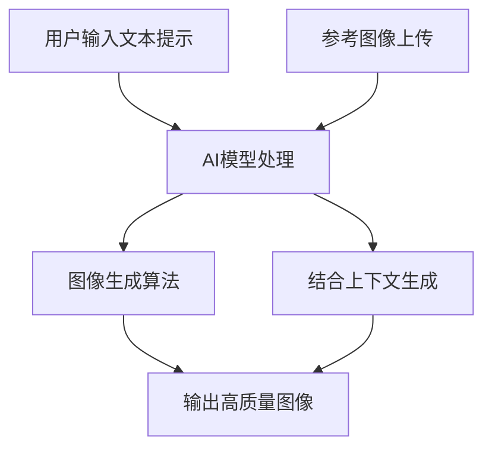
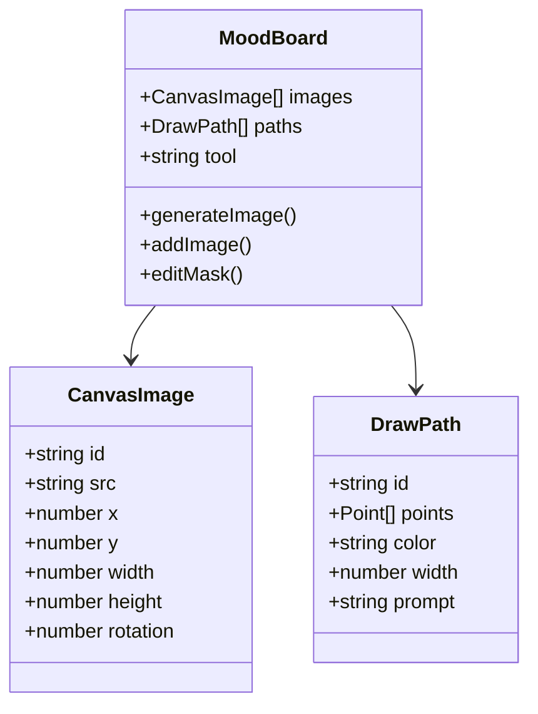
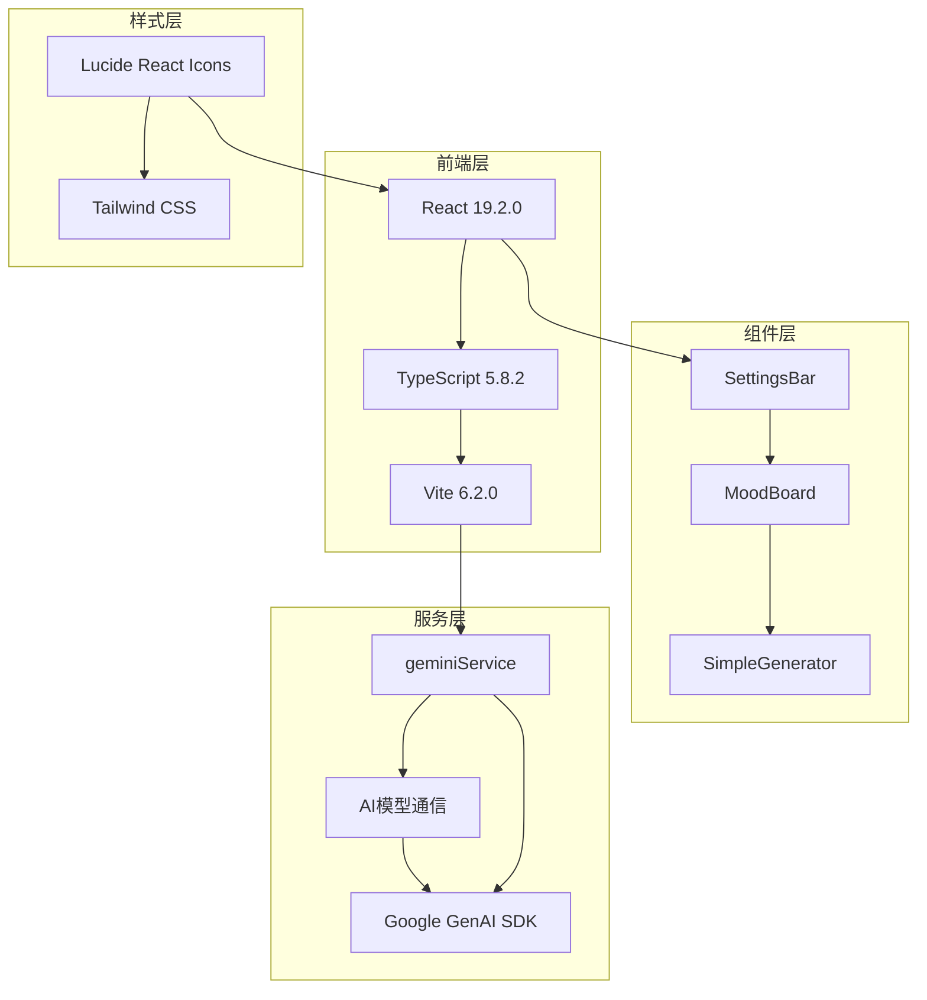
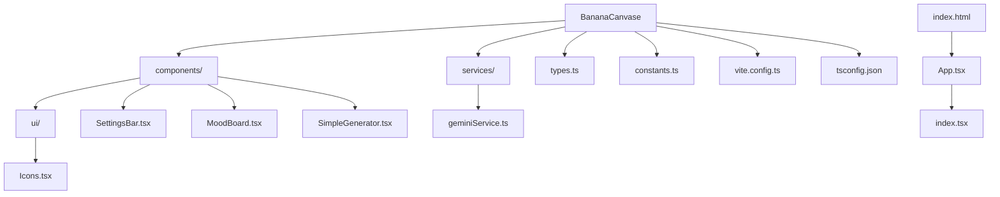
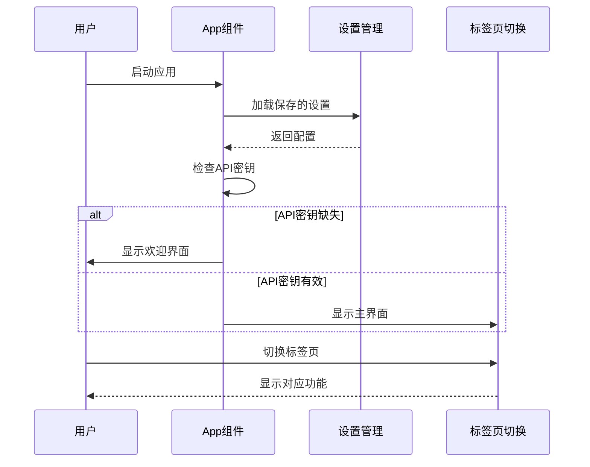
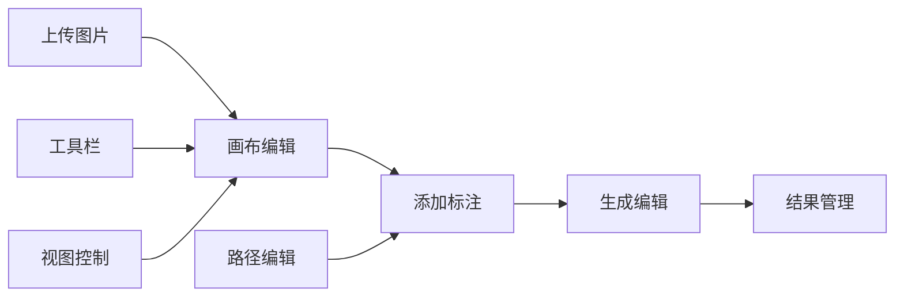
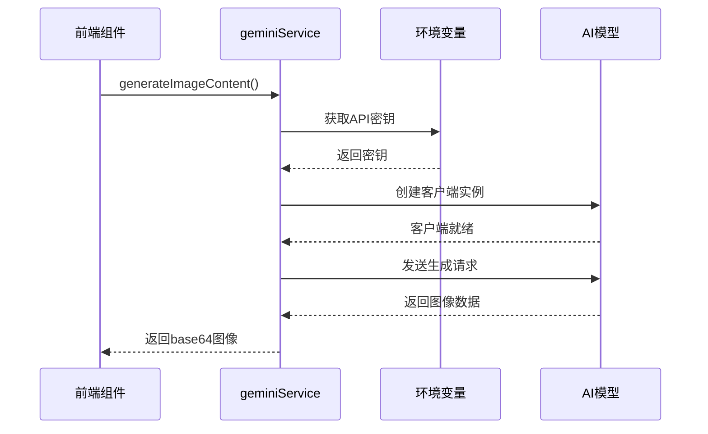
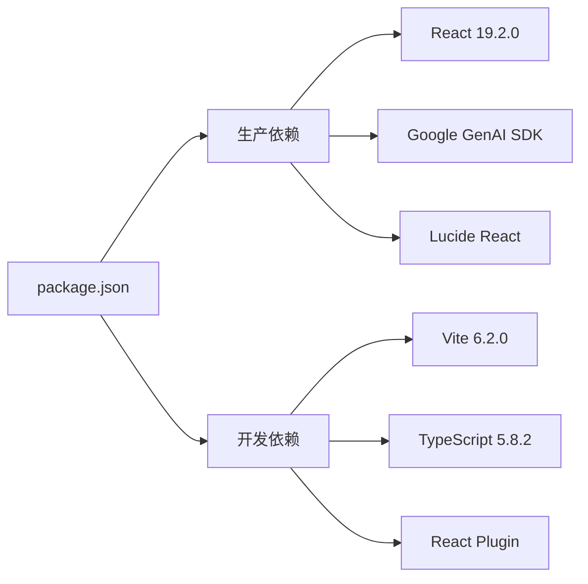
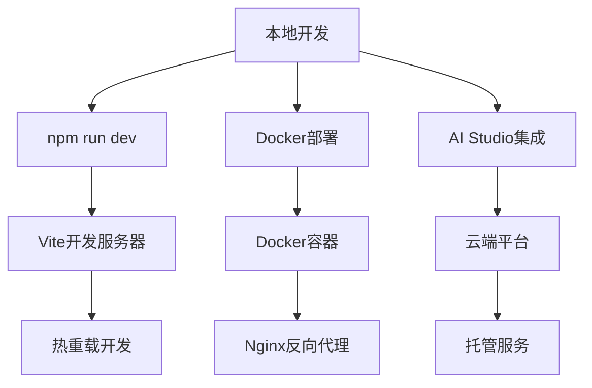
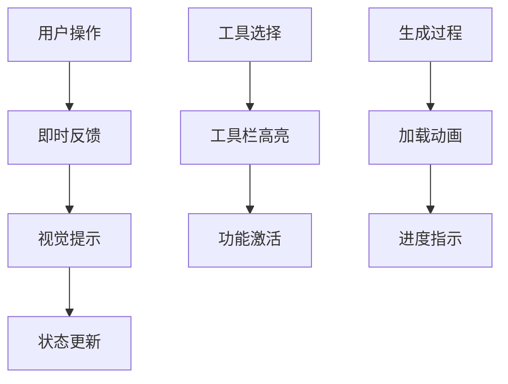

# BananaCanvase项目概述

<cite>
**本文档中引用的文件**
- [README.md](file://README.md)
- [package.json](file://package.json)
- [App.tsx](file://App.tsx)
- [index.tsx](file://index.tsx)
- [types.ts](file://types.ts)
- [components/SettingsBar.tsx](file://components/SettingsBar.tsx)
- [components/SimpleGenerator.tsx](file://components/SimpleGenerator.tsx)
- [components/MoodBoard.tsx](file://components/MoodBoard.tsx)
- [services/geminiService.ts](file://services/geminiService.ts)
- [constants.ts](file://constants.ts)
- [components/ui/Icons.tsx](file://components/ui/Icons.tsx)
- [vite.config.ts](file://vite.config.ts)
- [tsconfig.json](file://tsconfig.json)
- [DOCKER.md](file://DOCKER.md)
</cite>

## 目录
1. [项目简介](#项目简介)
2. [核心功能特性](#核心功能特性)
3. [技术架构概览](#技术架构概览)
4. [项目结构分析](#项目结构分析)
5. [核心组件详解](#核心组件详解)
6. [AI模型集成](#ai模型集成)
7. [开发环境配置](#开发环境配置)
8. [部署方案](#部署方案)
9. [用户体验设计](#用户体验设计)
10. [项目特色与优势](#项目特色与优势)
11. [总结](#总结)

## 项目简介

BananaCanvase是一个基于React和TypeScript的创新性AI图像生成与编辑应用，专为设计师、开发者和教育者打造。该项目的核心理念是将先进的人工智能技术与直观的用户界面相结合，让用户能够轻松地通过文本提示生成图像，并在画布上绘制注释来指导AI进行局部编辑。

### 项目目标

- **简化AI创作流程**：让非专业用户也能轻松使用先进的AI图像生成技术
- **提供直观编辑体验**：通过画布上的注释和标记实现精确的局部编辑
- **支持多种AI模型**：兼容Google Gemini和AIHubMix两大主流AI平台
- **跨平台部署能力**：支持本地运行和云端部署

### 应用场景

- **设计师工作流**：快速生成和编辑视觉元素
- **开发者原型制作**：快速创建产品原型和界面设计
- **教育学习工具**：帮助学生理解AI图像生成原理
- **创意表达平台**：为艺术家提供新的创作方式

## 核心功能特性

### 1. 文本驱动图像生成

BananaCanvase最核心的功能是通过自然语言描述生成高质量图像。用户只需输入详细的文本提示，AI就能根据描述生成相应的视觉内容。

**图表来源**
- [components/SimpleGenerator.tsx](file://components/SimpleGenerator.tsx#L30-L50)
- [services/geminiService.ts](file://services/geminiService.ts#L5-L15)

### 2. 智能画布编辑系统

MoodBoard组件提供了强大的画布编辑功能，支持：
- 多图层管理
- 自由绘图和标注
- 精确的区域选择
- 实时预览和编辑

**图表来源**
- [components/MoodBoard.tsx](file://components/MoodBoard.tsx#L15-L35)
- [types.ts](file://types.ts#L12-L34)

### 3. 多AI模型支持

项目支持两种主要的AI模型提供商：

| 提供商 | 模型名称 | 特点 | 适用场景 |
|--------|----------|------|----------|
| Google Gemini | Nano Banana | 快速生成，适合原型设计 | 快速迭代，成本敏感项目 |
| Google Gemini | Nano Banana Pro | 高质量生成，适合专业用途 | 专业设计，高质量要求 |

**节来源**
- [constants.ts](file://constants.ts#L8-L17)
- [services/geminiService.ts](file://services/geminiService.ts#L12-L28)

## 技术架构概览

BananaCanvase采用了现代化的前端技术栈，构建了一个高性能、可扩展的应用架构。

**图表来源**
- [package.json](file://package.json#L11-L21)
- [App.tsx](file://App.tsx#L1-L5)

### 架构特点

1. **组件化设计**：每个功能模块都封装为独立的React组件
2. **类型安全**：使用TypeScript确保代码质量和开发效率
3. **模块化服务**：AI服务逻辑独立封装，便于维护和扩展
4. **响应式设计**：支持桌面和移动设备的无缝体验

**节来源**
- [App.tsx](file://App.tsx#L8-L15)
- [vite.config.ts](file://vite.config.ts#L5-L24)

## 项目结构分析

BananaCanvase采用清晰的目录结构，遵循现代React应用的最佳实践。

**图表来源**
- [App.tsx](file://App.tsx#L1-L5)
- [components/SettingsBar.tsx](file://components/SettingsBar.tsx#L1-L5)

### 关键目录说明

- **components/**: 包含所有React组件，按功能分组
- **services/**: 封装业务逻辑和服务调用
- **types.ts**: 定义应用中的所有类型和接口
- **constants.ts**: 存储配置常量和枚举值

**节来源**
- [types.ts](file://types.ts#L1-L58)
- [constants.ts](file://constants.ts#L1-L18)

## 核心组件详解

### 1. 主应用组件 (App.tsx)

App.tsx是整个应用的根组件，负责状态管理和路由控制。

**图表来源**
- [App.tsx](file://App.tsx#L8-L45)

### 2. 设置管理组件 (SettingsBar.tsx)

SettingsBar提供了完整的配置管理界面，支持多种AI提供商和模型选择。

**主要功能**：
- API密钥管理
- AI提供商切换
- 模型参数配置
- Google AI Studio集成

**节来源**
- [components/SettingsBar.tsx](file://components/SettingsBar.tsx#L11-L170)

### 3. 图像生成组件 (SimpleGenerator.tsx)

SimpleGenerator专注于单次图像生成任务，提供简洁直观的用户界面。

**核心特性**：
- 文本提示输入
- 参考图像上传
- 实时生成预览
- 错误处理和反馈

**节来源**
- [components/SimpleGenerator.tsx](file://components/SimpleGenerator.tsx#L11-L148)

### 4. 智能画板组件 (MoodBoard.tsx)

MoodBoard是最复杂的功能组件，实现了完整的图像编辑工作流。

**图表来源**
- [components/MoodBoard.tsx](file://components/MoodBoard.tsx#L23-L50)

**节来源**
- [components/MoodBoard.tsx](file://components/MoodBoard.tsx#L1-L770)

## AI模型集成

### Gemini服务集成 (geminiService.ts)

geminiService是连接前端应用与AI模型的核心服务，负责处理所有的AI请求。

**图表来源**
- [services/geminiService.ts](file://services/geminiService.ts#L5-L107)

### 支持的AI模型

| 模型类型 | 模型ID | 描述 | 性能特点 |
|----------|--------|------|----------|
| 快速生成 | nano-banana | Gemini 2.5 Flash Image | 高速度，适合原型设计 |
| 高质量生成 | nano-banana-pro | Gemini 3 Pro Image Preview | 高质量，适合专业用途 |

**节来源**
- [services/geminiService.ts](file://services/geminiService.ts#L32-L33)
- [constants.ts](file://constants.ts#L14-L17)

### 错误处理机制

系统实现了完善的错误处理机制：

1. **API密钥验证**：检查密钥有效性
2. **权限错误处理**：自动触发重新认证
3. **网络异常处理**：提供友好的错误提示
4. **模型响应解析**：处理不同格式的AI响应

**节来源**
- [services/geminiService.ts](file://services/geminiService.ts#L98-L107)

## 开发环境配置

### 依赖包管理

BananaCanvase使用现代化的依赖管理策略：

**图表来源**
- [package.json](file://package.json#L11-L21)

### TypeScript配置

项目采用严格的TypeScript配置，确保代码质量：

- **模块系统**：ESNext模块
- **目标版本**：ES2022
- **JSX处理**：React JSX转换
- **路径别名**：@/* 对应 ./*

**节来源**
- [tsconfig.json](file://tsconfig.json#L2-L28)

### Vite构建配置

Vite提供了快速的开发体验和高效的构建性能：

- **开发服务器**：端口3000，支持热重载
- **环境变量**：支持API密钥注入
- **路径别名**：简化导入路径

**节来源**
- [vite.config.ts](file://vite.config.ts#L5-L24)

## 部署方案

### 本地开发部署

项目支持多种部署方式，满足不同的开发和生产需求。

**图表来源**
- [DOCKER.md](file://DOCKER.md#L1-L22)

### Docker部署

项目提供了完整的Docker化部署方案：

**构建选项**：
1. **docker-compose**：推荐方式，包含Nginx反向代理
2. **独立Docker**：直接容器运行
3. **构建时注入**：支持API密钥注入

**端口配置**：
- 容器内部：80端口（Nginx）
- 宿主机映射：3000端口

**节来源**
- [DOCKER.md](file://DOCKER.md#L1-L80)

### AI Studio集成

项目特别针对AI Studio平台进行了优化：

- **API密钥管理**：支持平台内置的密钥选择器
- **环境检测**：自动识别AI Studio运行环境
- **无缝认证**：简化用户认证流程

**节来源**
- [App.tsx](file://App.tsx#L48-L62)

## 用户体验设计

### 视觉设计原则

BananaCanvase采用了现代化的设计语言：

- **深色主题**：减少眼睛疲劳，突出内容
- **香蕉配色**：品牌标识性的橙色点缀
- **响应式布局**：适配各种屏幕尺寸
- **直观交互**：符合用户直觉的操作方式

### 交互设计特点

**图表来源**
- [components/MoodBoard.tsx](file://components/MoodBoard.tsx#L556-L635)

### 功能导航

应用提供清晰的功能导航：

1. **简单生成器**：专注于单次图像生成
2. **情绪板编辑**：复杂的多图层编辑
3. **设置管理**：统一的配置中心

**节来源**
- [App.tsx](file://App.tsx#L102-L126)

## 项目特色与优势

### 技术优势

1. **现代化技术栈**：React 19 + TypeScript + Vite
2. **类型安全**：完整的TypeScript类型定义
3. **性能优化**：Vite提供的快速构建和开发体验
4. **可扩展性**：模块化架构便于功能扩展

### 用户价值

1. **易用性**：直观的界面设计，降低学习成本
2. **灵活性**：支持多种AI模型和编辑模式
3. **专业性**：满足设计师和开发者的专业需求
4. **集成性**：与AI Studio等平台深度集成

### 教育意义

- **AI普及**：让普通用户接触和使用AI技术
- **创意启发**：激发用户的创意思维
- **技术展示**：演示现代Web技术的实际应用

## 总结

BananaCanvase代表了AI技术与现代Web开发的完美结合。作为一个基于React和TypeScript的前端AI图像生成与编辑应用，它不仅展示了先进技术的实用性，更为用户提供了强大而易用的创意工具。

### 核心成就

1. **技术创新**：成功整合了Google Gemini和AIHubMix两大AI平台
2. **用户体验**：创造了直观且功能丰富的编辑界面
3. **技术实践**：展现了现代前端技术栈的最佳实践
4. **教育价值**：为AI技术的普及和应用提供了优秀的范例

### 未来展望

BananaCanvase项目为AI创意工具的发展奠定了坚实的基础。随着AI技术的不断进步和用户需求的增长，这个项目将继续演进，为更多用户提供创新的AI创作体验。

无论是对于初学者还是高级用户，BananaCanvase都展现出了巨大的潜力和价值。它不仅是一个实用的工具，更是现代Web技术和AI技术融合的优秀案例。